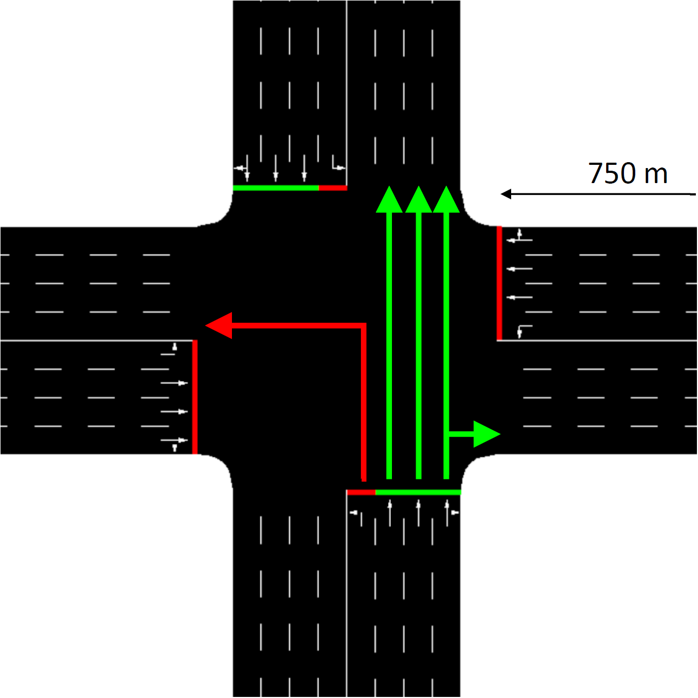

# Deep Q-Learning Agent for Traffic Signal Control

> **Note:** this project was refactored in November 2025 to improve clarity and modernize the tooling. The previous version is available at [this commit](https://github.com/AndreaVidali/Deep-QLearning-Agent-for-Traffic-Signal-Control/tree/8ee45192c0ef6b3d43dd660505a38b5030b79be7).

A PyTorch-based Deep Q-Learning agent that learns to operate a single 4-way intersection in **SUMO**. The repo bundles a configurable training pipeline, a small CLI, and plotting utilities so you can focus on experimenting.

- **Agent**: epsilon-greedy DQN with experience replay and a configurable fully connected network.
- **Environment**: fixed SUMO intersection; state is 80 binary cells from discretized incoming lanes; 4 traffic-signal actions.
- **Outputs**: trained model, copied settings, and plots for rewards, delay, and queue lengths.

## Prerequisites

- [uv](https://astral.sh/uv) installed.
- Python 3.13 (see `pyproject.toml`; you can manage Python versions directly via [uv](https://astral.sh/uv), which can download it for you).
- SUMO installed and available via `sumo` / `sumo-gui` on your PATH. To do so, the environment variable `SUMO_HOME` must be set. For specific instructions, check out the [official installation page](https://sumo.dlr.de/docs/Installing/index.htm).
- GPU is optional; the default configuration trains on CPU.

> **Note:** as of November 2025, macOS Tahoe and SUMO-GUI have an issue that can crash the SUMO GUI. In particular, the bug lies with the XQuartz library. See:
>
> - https://github.com/eclipse-sumo/sumo/issues/17272
> - https://github.com/XQuartz/XQuartz/issues/446
> - https://github.com/XQuartz/XQuartz/issues/438#issuecomment-3350746279

## Getting started

Clone the repo. Then from the project root, install the dependencies:

```bash
uv sync
```

Activate the virtual environment:

```bash
source .venv/bin/activate   # on Windows: .venv\Scripts\activate
```

To check if the installation was successful, verify that the CLI is available:

```bash
tlcs --help
```

When you are finished, deactivate the virtual environment:

```bash
deactivate
```

Alternatively, if you prefer not to activate the environment explicitly, you can run commands via uv:

```bash
uv run tlcs --help
```

## Train and test

Training and testing read YAML configuration from `settings/`. Both commands prompt before overwriting existing output folders.

- **Train** (defaults to `settings/training_settings.yaml`, writes to `model/`):

  ```bash
  tlcs train
  # or choose a custom run folder
  tlcs train --out-path model/run-01
  ```

- **Test** a trained run (defaults to `settings/testing_settings.yaml`, writes to `model/<run>/test/`):

  ```bash
  tlcs test --model-path model/run-01 --test-name foo
  ```

Discover all options with:

```bash
tlcs train --help
tlcs test --help
```

## The settings

Configs live in `settings/` and are validated at runtime.

`training_settings.yaml`

- `gui`: run SUMO with (`true`) or without (`false`) the GUI.
- `total_episodes`, `max_steps`, `n_cars_generated`: episode count, length, and traffic volume.
- `green_duration`, `yellow_duration`: phase durations in seconds.
- `turn_chance`: probability that a vehicle turns instead of going straight.
- `num_layers`, `width_layers`: hidden layer count and width for the neural network.
- `batch_size`, `learning_rate`, `training_epochs`: replay batch size, optimizer LR, and training passes per episode.
- `memory_size_min`, `memory_size_max`: replay buffer warmup and capacity.
- `gamma`: discount factor.
- `sumocfg_file`: SUMO config path (defaults to `intersection/sumo_config.sumocfg`).

`testing_settings.yaml`

- Mirrors the simulation settings (`gui`, `max_steps`, `n_cars_generated`, `green_duration`, `yellow_duration`, `turn_chance`, `gamma`, `sumocfg_file`) plus:
- `episode_seed`: deterministic route generation for a reproducible test episode.

## What gets saved

Each training run writes to the chosen output training folder:

- `trained_model.pt`: serialized PyTorch model.
- `training_settings.yaml`: copy of the settings used.
- `plot_reward.png`, `plot_delay.png`, `plot_queue.png` and matching `*_data.txt` files.
- Testing outputs are saved within the training folder in a dedicated testing subfolder with reward and queue plots plus data.

## Project layout

- `src/tlcs/cli.py`: CLI exposing `tlcs train` and `tlcs test`.
- `src/tlcs/main.py`: orchestrates training/testing loops and stats aggregation.
- `src/tlcs/agent.py`, `model.py`, `memory.py`: epsilon-greedy policy, MLP, and replay buffer.
- `src/tlcs/env.py`: SUMO wrapper (state extraction, reward, action execution).
- `src/tlcs/generator.py`: per-episode route generation.
- `src/tlcs/plots.py`: saves plots plus raw data.
- `intersection/`: SUMO assets (`environment.net.xml`, `sumo_config.sumocfg`, generated `episode_routes.rou.xml`).
- `settings/`: YAML configs for training and testing.

## Methodology

<p align="center">
  
</p>
<p align="center">
  <em>Intersection used in the experiments.</em>
</p>

### Scenario and state

- Single 4-way junction; each arm has four incoming lanes over 750 m.
- Incoming lanes are grouped by movement (left vs. straight/right), creating **8 lane groups**.
- Each group is discretized into **10 distance buckets** (closer to the light -> higher bucket index) for **80 binary cells** total.
- State vector: length-80 array with `1` if at least one vehicle occupies a cell, else `0`.

<p align="center">
  
</p>
<p align="center">
  <em>State encoding for one arm.</em>
</p>

### Actions and signals

Four fixed green phases (yellow inserted automatically on phase changes):

1. North-South straight/right
2. North-South left
3. East-West straight/right
4. East-West left

`green_duration` and `yellow_duration` control how long each phase lasts.

### Reward

Reward is the **change in cumulative waiting time** on incoming edges:

```
reward = previous_total_wait - current_total_wait
```

Reducing total wait yields positive reward.

### Traffic generation

- One route file per episode generated on the fly.
- Departure times follow a Weibull distribution scaled to `[0, max_steps]`.
- `turn_chance` controls whether a vehicle draws from turning routes versus straight routes.
- Seeds (episode index for training; `episode_seed` for testing) make runs reproducible.

### Policy and learning loop

- Epsilon-greedy exploration: epsilon decays linearly from 1.0 to 0 over all training episodes.
- Q-targets follow `r + gamma * max_a' Q(next_state, a')`.
- Experience replay with warmup (`memory_size_min`) and bounded buffer (`memory_size_max`).
- Neural network architecture configurable via `num_layers` and `width_layers`; trained with MSE loss and Adam.

For each episode:

1. Generate routes.
2. Run SUMO until `max_steps`.
3. Collect transitions.
4. Push to replay.
5. run `training_epochs` replay batches.
6. Log/plot cumulative negative reward, cumulative delay, and average queue length.

## Tips

- Prefer headless mode (`gui: false`) for training; enable the GUI only when debugging a run or for the testing phase.
- If an output directory already exists, the CLI asks before overwriting it.

## License

MIT - see `LICENSE`.

## Notes

Hi 👋 my name is Andrea, the maintainer of this project.

If you encounter a bug or need more information about this project, please open an issue.

If this repo helped you and you’d like to say thanks, consider buying me a coffee:

<a href="https://www.buymeacoffee.com/andreavidali" target="_blank"></a>
